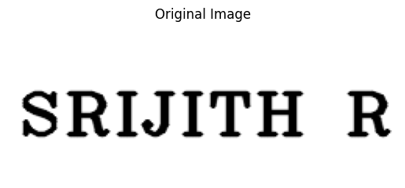
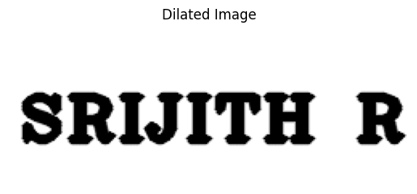

# Implementation-of-Erosion-and-Dilation
## Aim
To implement Erosion and Dilation using Python and OpenCV.
## Software Required
1. Anaconda - Python 3.7
2. OpenCV
## Algorithm:
### Step1:
Import the necessary packages.
<br>

### Step2:
Create the text image using cv2.putText().
<br>

### Step3:
Create the structuring kernel for image dilation and erosion.
<br>

### Step4:
Apply erosion and dilation using cv2.erode and cv2.dilate.
<br>

### Step5:
Plot the images using plt.imshow().
<br>
<br>
<br>
 
## Program:
```python
# program by : SRIJITH R
# reg no : 212221240054
```
### Import the necessary packages
``` Python
import cv2
import numpy as np
from matplotlib import pyplot as plt
```
### Create the Text using cv2.putText
```python
# Create the text using cv2.putText
text_image = np.zeros((100,250),dtype = 'uint8')
font = cv2.FONT_HERSHEY_COMPLEX_SMALL
cv2.putText(text_image,"SRIJITH",(5,70),font,2,(255),2,cv2.LINE_AA) 
plt.title("Original Image")
plt.imshow(text_image,'binary')
plt.axis('off')
```
### Create the structuring element
```python
kernel = cv2.getStructuringElement(cv2.MORPH_CROSS,(4,4))
```
### Erode the image
```python
image_erode = cv2.erode(text_image,kernel)
plt.title("Eroded Image")
plt.imshow(image_erode,'bianry')
plt.axis('off')
```
### Dilate the image
```python
image_dilate = cv2.dilate(text_image,kernel)
plt.title("Dilated Image")
plt.imshow(image_dilate,'binary')
plt.axis('off')
```
## Output:

### Display the input Image

<br>

### Display the Eroded Image

<br>

### Dilated Image

<br>
<br>
<br>

## Result
Thus the generated text image is eroded and dilated using python and OpenCV.
